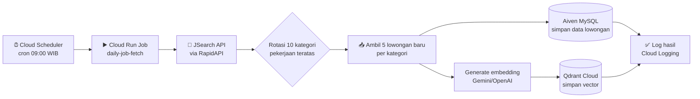
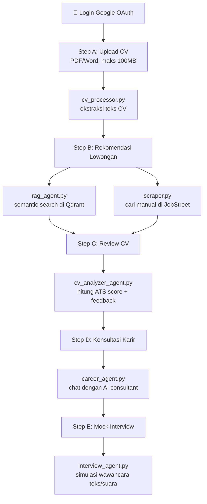
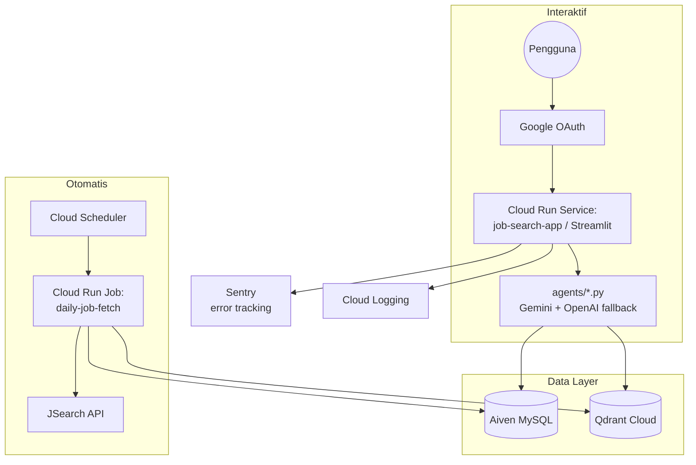

# 🔄 Workflow — JobMatch AI

Dokumen ini menjelaskan alur kerja sistem end-to-end: baik alur otomatis (auto-fetch lowongan harian) maupun alur interaktif (perjalanan pengguna lewat 5 step wizard).

> **Catatan soal n8n:** requirement resmi final project (`rule/[JCAI - 2025] Final Project - N8N Version.docx`) mengacu ke versi berbasis n8n. Implementasi saat ini **tidak** memakai n8n sebagai orchestrator — otomasi harian digantikan dengan **Google Cloud Scheduler + Cloud Run Job**, dan agent AI diimplementasikan sebagai modul Python (`agents/`) alih-alih node n8n. Diagram di bawah menggambarkan node-node fungsional dengan gaya yang sama seperti workflow n8n (trigger → proses → output), supaya tetap mudah dipetakan ke versi n8n bila suatu saat migrasi dilakukan.

---

## 1. Workflow Otomatis — Auto-fetch Lowongan Harian

**Node breakdown:**

| Node | Fungsi | File terkait |
|---|---|---|
| Trigger: Cloud Scheduler | Memicu job setiap hari jam 09:00 WIB | — (konfigurasi GCP) |
| Cloud Run Job | Entry point eksekusi fetch harian | `daily_fetch.py` |
| JSearch API Client | Ambil data lowongan dari RapidAPI | `jsearch_client.py` |
| Simpan ke MySQL | Persist data lowongan terstruktur | `database.py` |
| Generate Embedding | Ubah teks lowongan jadi vector untuk semantic search | `vector_store.py` |
| Simpan ke Qdrant | Persist vector untuk pencarian semantik | `vector_store.py` |
| Logging | Catat hasil run (jumlah lowongan baru, error, dsb) | `logger.py` |

---

## 2. Workflow Interaktif — Perjalanan Pengguna (Step A–E)

**Node breakdown:**

| Step | Fungsi | Agent/Modul |
|---|---|---|
| A — Input CV | Upload & validasi file CV | `step_a_input_cv.py`, `cv_processor.py` |
| B — Rekomendasi Lowongan | Cocokkan CV dengan lowongan (semantic + manual) | `step_b_jobs.py`, `rag_agent.py`, `scraper.py` |
| C — Review CV | Analisis ATS score, feedback, generate versi baru | `step_c_review.py`, `cv_analyzer_agent.py` |
| D — Konsultasi Karir | Chat interaktif seputar strategi karir | `step_d_consultation.py`, `career_agent.py` |
| E — Mock Interview | Simulasi wawancara kerja | `step_e_interview.py`, `interview_agent.py` |

---

## 3. Arsitektur Sistem Keseluruhan

---

## 4. Catatan Observability

- **Health check**: `health_check.py` / `health_server.py` menyediakan endpoint yang dicek Cloud Run untuk memastikan service hidup.
- **Logging**: `logger.py` dan `metrics.py` mengirim structured JSON log ke Cloud Logging.
- **Error tracking**: Sentry aktif jika `SENTRY_DSN` diset.
