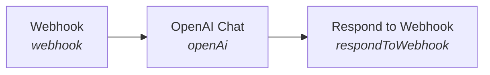

```mermaid
flowchart LR
    Webhook["Webhook<br/><i>webhook</i>"]
    OpenAI_Chat["OpenAI Chat<br/><i>openAi</i>"]
    Respond_to_Webhook["Respond to Webhook<br/><i>respondToWebhook</i>"]
    Webhook --> OpenAI_Chat
    OpenAI_Chat --> Respond_to_Webhook
```
