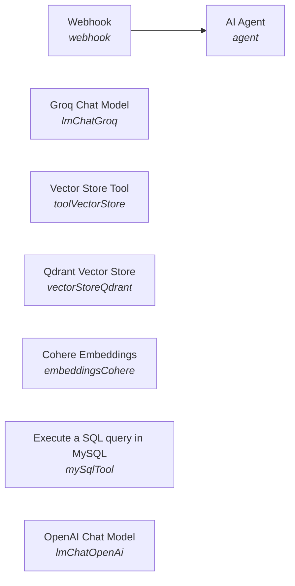

```mermaid
flowchart LR
    Webhook["Webhook<br/><i>webhook</i>"]
    AI_Agent["AI Agent<br/><i>agent</i>"]
    Groq_Chat_Model["Groq Chat Model<br/><i>lmChatGroq</i>"]
    Vector_Store_Tool["Vector Store Tool<br/><i>toolVectorStore</i>"]
    Qdrant_Vector_Store["Qdrant Vector Store<br/><i>vectorStoreQdrant</i>"]
    Cohere_Embeddings["Cohere Embeddings<br/><i>embeddingsCohere</i>"]
    Execute_a_SQL_query_in_MySQL["Execute a SQL query in MySQL<br/><i>mySqlTool</i>"]
    OpenAI_Chat_Model["OpenAI Chat Model<br/><i>lmChatOpenAi</i>"]
    Webhook --> AI_Agent
```
